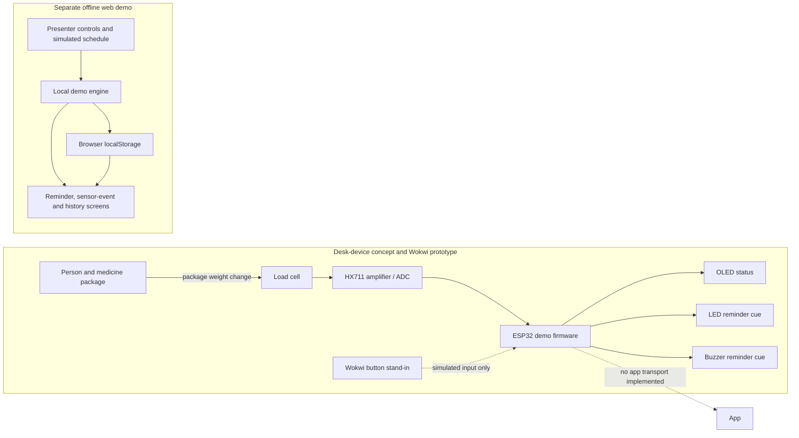

# MediSync System Architecture

## Purpose and scope

MediSync is a medication-reminder concept with a desk-device prototype track and a separate offline web demonstration. The current artifacts do not form a connected end-to-end system: the Wokwi/ESP32 prototype and the browser app run independently, and the app has no live device connection.

This document distinguishes the current simulations and code from product concepts and future integrations. Sensor-observed events do **not** prove ingestion or confirm that a person swallowed a dose.

## System at a glance



The dashed device-to-app line is a future integration boundary, not a working connection. The web app creates its own fictional sensor events and reminder history.

## Device concept and prototype boundary

### Desk device

The primary product concept is a stationary, desk or home medication reminder device. Concept renders show a desk form, and the broader design describes a multi-position unit (12 positions in the planned full version). This is not evidence of a built 12-position dispenser. The inspected Wokwi firmware demonstrates a single medication example (`DemoMed`) and one load-cell input; no automated dispensing mechanism was verified.

The Wokwi prototype uses an ESP32, OLED, HX711 with a simulated 5 kg load cell, one LED, and a buzzer. The prior code inspection found the HX711 data and clock pins on GPIO 18 and 19 and the LED and buzzer on GPIO 25 and 26. The firmware includes a baseline/tare step, periodic readings, a simulated gram conversion, a 1 g event threshold, and an unresolved event state. These are prototype behaviors, not validated medication-adherence measurements.

### Portable concept

The archive includes portable-device renders. They support describing a portable form as a **visual concept only**. No portable electronics, battery design, sensor arrangement, firmware, or operational prototype was confirmed, so this document makes no claims about those details.

### Sensors and simulation inputs

- **Weight sensing:** The concept uses a load cell connected through an HX711 to the ESP32. In Wokwi, the HX711 exposes an adjustable simulated load. Changing that value is a simulator control; it is not a physical pill-removal test, and calibration against real packages has not been verified.
- **IR/presence input:** The Wokwi button is used as a stand-in for an IR sensor. The button-as-IR substitute is simulation only; it does not model IR range, optics, ambient-light effects, or real sensor performance. A real IR sensor has not been verified in the supplied repository snapshot.
- **What sensing can establish:** A package-weight change or simulated presence input can produce an observed event. Neither identifies the medication taken nor verifies ingestion. A weight change can also have causes unrelated to taking a dose.

## Reminder and event flow

### ESP32/Wokwi demonstration

The inspected firmware sequence is:

1. Initialize the ESP32, display, HX711, LED, and buzzer; report a sensor error if the HX711 is not ready.
2. Show a welcome/demo screen, then begin a timed reminder. The OLED indicates that a reminder is due while the LED blinks and the buzzer sounds in pulses.
3. Stop the reminder outputs and establish a load-cell baseline (tare).
4. Sample the HX711 and calculate a simulated weight delta. If the delta reaches the configured threshold, display and log an event as **unresolved**.
5. Otherwise keep monitoring in the demo state.

This is a timed demonstration sequence, not a verified real-time medication schedule. The code path exists, but the prior Wokwi inspection observed the display reach monitoring while remaining at `0.0 g`; reliable load-change detection and calibration therefore remain unverified. Wokwi's adjustable HX711 load is simulation only.

### Offline browser demonstration

The app has its own independent reminder flow. In demo time it can show an LED cue before the scheduled alert, represent the scheduled buzzer, advance through local +5 and +10 minute escalations, and mark a reminder unresolved (15 minutes by default). Presenter controls can create a mock weight change, a same-weight/no-change example, or an unresolved event. The settings allow the demonstration timings to be shortened or changed.

These controls update local demo state and history. The LED and buzzer are visual/audio representations in the UI; no physical outputs are driven by the browser. A mock weight change is labeled unverified and is not proof of ingestion.

## Components and data flow

### Wokwi/ESP32 track

```text
Wokwi-adjusted load (simulated)
  → HX711 reading
  → ESP32 baseline and delta calculation
  → OLED / LED / buzzer feedback
  → local prototype status and serial messages
```

The supplied ZIP does not contain the firmware or Wokwi project files. This description of that track comes from the prior inspection in the referenced conversation. No event transport from the simulator or ESP32 into the browser app was found or demonstrated.

### Offline web app

```text
Local presenter action or simulated time advance
  → demo engine updates reminder/event state
  → app screens render the state and event history
  → browser localStorage persists fictional demo data
```

The archive contains a static `App/index.html`, JavaScript, CSS, and an app README. It opens locally in a modern browser and does not require a backend, account, package installation, internet access, or external assets. Its Content Security Policy sets `connect-src 'none'`; the inspected app does not call remote APIs. Its medicines, profile, settings, reminders, and events are demo data stored in that browser's `localStorage`. That storage is not encrypted; do not enter real patient information.

## Implemented, simulated, and planned

| Area | Confirmed status |
| --- | --- |
| Offline web demo | Implemented as a local static browser app with fictional medicines, editable demo settings, reminder controls, mock weight events, and local history. |
| Browser persistence | Implemented with browser `localStorage`; local-only for this prototype and not encrypted. |
| ESP32 reminder/sensing flow | Prior inspection found firmware code and a separate Wokwi project using ESP32, OLED, HX711/load cell, LED, and buzzer. The provided ZIP does not include that project. Successful sensor response is not verified. |
| Adjustable HX711 value | Wokwi simulation input only. It does not represent calibrated physical sensing. |
| Button used as IR stand-in | Simulation input only; it does not validate a real IR sensor. |
| Desk device | Concept renders and a planned multi-position design; a complete physical desk unit was not confirmed. |
| Portable device | Rendered concept only; hardware and behavior are unverified. |
| App-to-device link | Not implemented. The app has no live ESP32, HX711, Bluetooth, or Wi-Fi connection. |
| Ingestion/adherence confirmation | Not implemented. Sensor-observed events cannot prove ingestion. |
| AI, cloud services, caregiver alerts, hospital integration, and TEE | Planned or mock concepts only; no live model, cloud service, caregiver account/alert, hospital connection, or deployed trusted execution environment was confirmed. |

## Evidence and open verification

**Confirmed from the supplied ZIP:** the local app files and README, local demo engine and browser storage, simulated weight/reminder events, offline-only network policy, and desk/portable concept renders. The ZIP contains no firmware or Wokwi project files.

**Confirmed by prior inspection in the referenced conversation:** a separate ESP32/Wokwi prototype was inspected; its code described the reminder-to-baseline-to-monitoring flow and an unresolved detected-event state. A Wokwi run was observed reaching monitoring at `0.0 g`. The separate prototype used an adjustable HX711 load in simulation.

**Still unverified:** a reliable Wokwi load change producing an event; physical load-cell calibration and performance; real IR sensing; physical-device operation; the portable version; a live app/device connection; and any confirmation that a person ingested medication. AI, cloud, caregiver, hospital, and TEE capabilities remain planned or mocked.

Until those items are built and validated, treat the project as a prototype and visual demonstration, not a medication-adherence record or clinical confirmation system.
